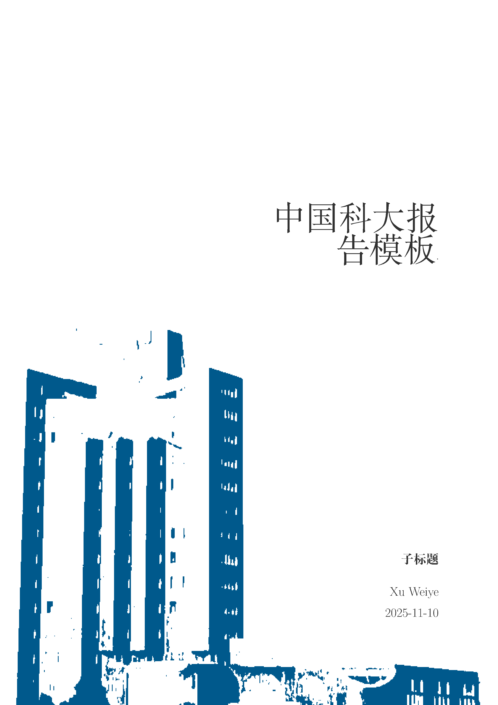
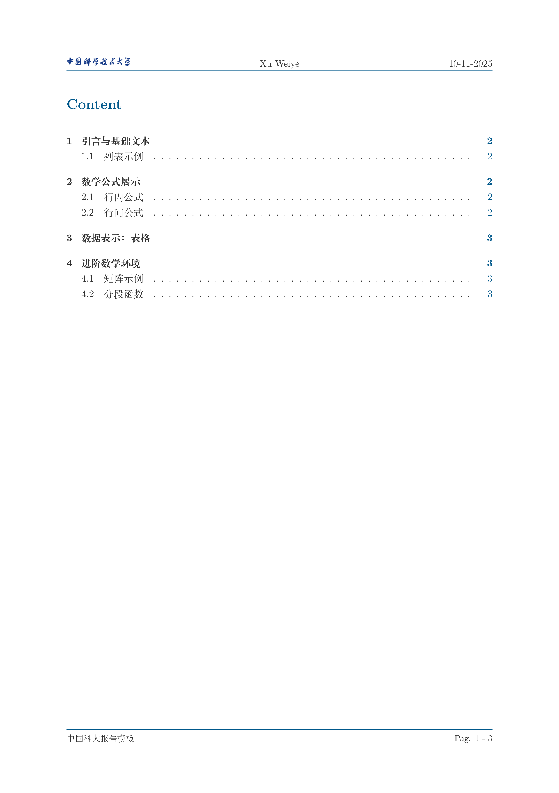
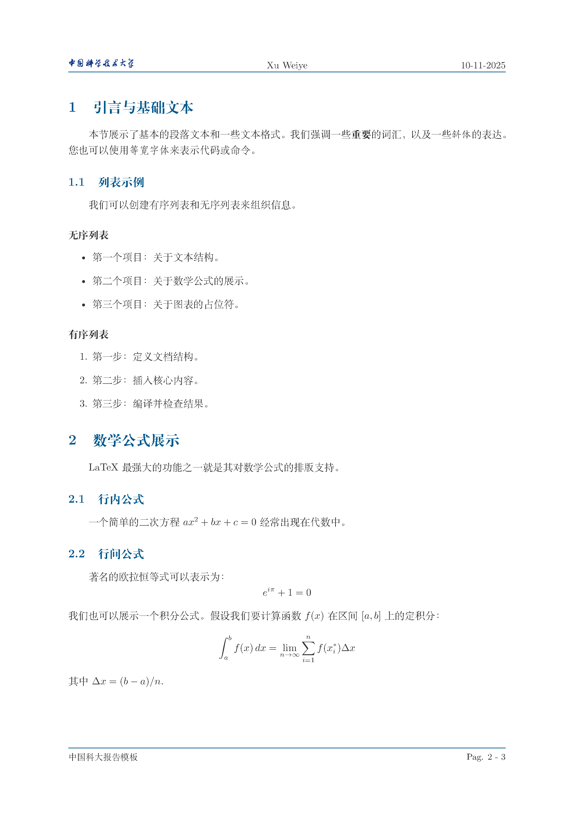
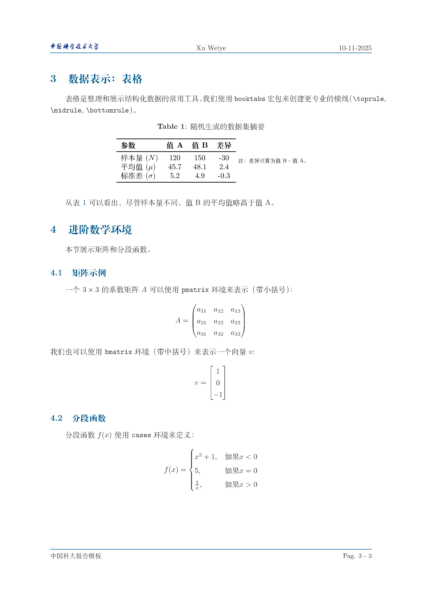
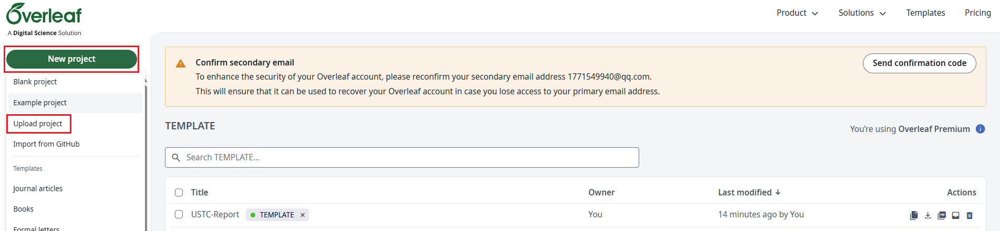
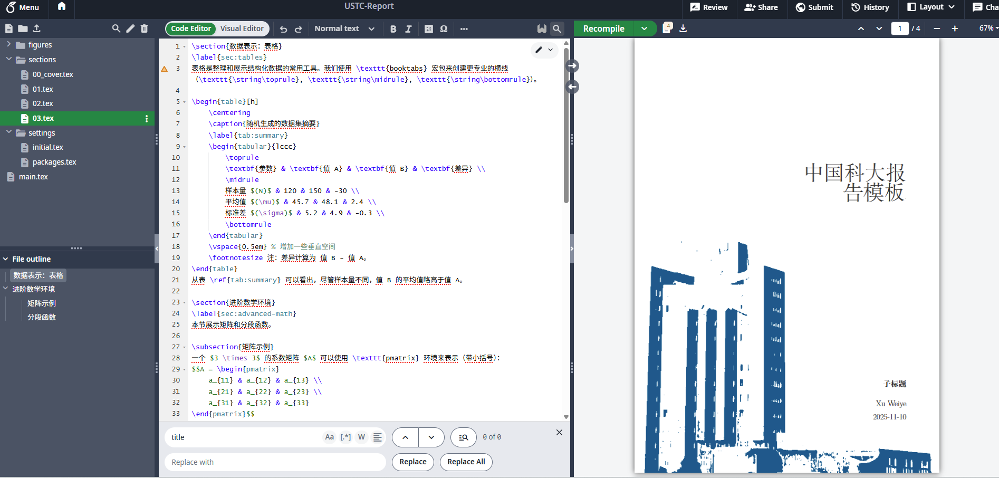

## 简介
这是中国科学技术大学课程作业模板，适用于课程作业或者汇报等场景的撰写。本模板基于 LaTeX 排版系统，提供了统一的格式和样式，提供精美版面的同时方便学生从排版中解脱出来，专注于内容的创作。如果你有关于本模板的良好意见和建议，请在顶栏的问题(issue)一栏中提出。

**注意:** 本模板仅供课程作业和汇报使用，不要用于毕业论文等正式场合。

有任何问题可以联系：xuweiye@mail.ustc.edu.cn

## 模板展示


<div style="display:flex;gap:1rem;align-items:flex-start;">
    <figure style="margin:0;width:24%">
        
        <figcaption style="text-align:center;font-size:0.9em">封面</figcaption>
    </figure>
    <figure style="margin:0;width:24%">
        
        <figcaption style="text-align:center;font-size:0.9em">目录</figcaption>
    </figure>
    <figure style="margin:0;width:24%">
        
        <figcaption style="text-align:center;font-size:0.9em">内容</figcaption>
    </figure>
    <figure style="margin:0;width:24%">
        
        <figcaption style="text-align:center;font-size:0.9em">内容</figcaption>
    </figure>
</div>

## 使用方法

1. 下载本模板：
再github页面点击右上角的绿色按钮 "Code"，选择 "Download ZIP" 下载本模板压缩包（先不要解压）。
2. 上传到 Overleaf 在线使用：
进入https://www.overleaf.com/project, 点击`New Project`，选择`Upload Project`，上传刚才下载的压缩包即可使用本模板。

Overleaf 在线使用：
下载本模板后，上传至 Overleaf 即可使用。


修改配置信息：
在 `settings/initial.tex` 文件中修改以下信息：
```tex
\renewcommand{\title}{中国科大报告模板}
\renewcommand{\author}{Xu Weiye}
\renewcommand{\date}{\DTMdate{2025-11-10}}
\renewcommand{\COVERSUBTITLE}{子标题}
```